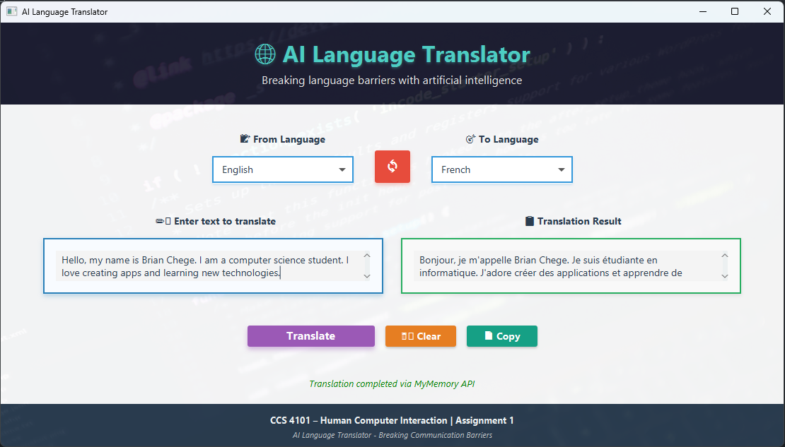

# AI Language Translator - HCI Assignment 1



*A modern desktop translation application demonstrating Human-Computer Interaction principles*

## Assignment Information

**Course:** CCS 4101 – Human Computer Interaction  
**Institution:** Dedan Kimathi University of Technology  
**Department:** Computer Science  
**Date Issued:** 19th June 2025  
**Due Date:** 27th June 2025  

## Team Members

**Brian Chege** - C026-01-0957/2022

**[Team Member 2]** - [Registration Number]

**[Team Member 3]** - [Registration Number]

**[Team Member 4]** - [Registration Number]

*Please update the remaining team member information*

## Project Overview

Our team selected the AI Language Translator as our Fourth Year Project for this Human-Computer Interaction assignment. This desktop application demonstrates the practical implementation of HCI principles through a user-friendly translation interface built with Java SpringBoot and JavaFX.

The translator provides an intuitive way for users to translate text between multiple languages, emphasizing usability, accessibility, and modern design principles that make technology more human-centered.

## Why We Chose This Project

Language translation is a universal need in our interconnected world. We wanted to create something that:
- Solves a real-world communication problem
- Allows us to showcase multiple HCI principles
- Provides a rich interface for demonstrating JavaFX capabilities
- Appeals to a diverse user base with different language needs

## Technology Stack

- **Frontend:** JavaFX (Java Effects) - Rich desktop UI components
- **Framework:** Spring Boot - Application structure and dependency management
- **Language:** Java 17 - Modern Java features and performance
- **Build Tool:** Maven - Dependency management and project building
- **Styling:** CSS - Modern visual design and theming

## Key Features

### Translation Capabilities
- **Multi-Language Support:** English, Spanish, French, German, Chinese, Japanese, Russian, Arabic, Hindi, and Swahili
- **Bidirectional Translation:** Easy switching between source and target languages
- **Large Text Support:** Handles both short phrases and longer text blocks
- **Mock Translation Engine:** Demonstrates functionality (ready for real API integration)

### User Interface Excellence
- **Clean, Modern Design:** Professional appearance following current design trends
- **Intuitive Layout:** Left-to-right translation flow that feels natural
- **Responsive Components:** Interface elements that provide clear feedback
- **Accessibility Features:** High contrast colors and readable typography

## Human-Computer Interaction Principles

Our application demonstrates all key HCI principles learned in class:

### 1. Visibility of System Status
The interface always keeps users informed about what's happening:
- Language selection is clearly displayed in dropdown menus
- Translation button shows when the system is ready to process
- Text areas provide immediate visual feedback for user input
- Status messages guide users through the translation process

### 2. Match Between System and Real World
We designed the interface using familiar concepts:
- "Source Language" and "Target Language" labels use everyday terminology
- Left-to-right layout mirrors natural reading and translation flow
- Dropdown menus work like real-world selection mechanisms
- Button interactions follow standard desktop application patterns

### 3. User Control and Freedom
Users have complete control over their translation experience:
- Easy language switching without losing entered text
- Text can be edited at any time before translation
- Clear areas for both input and output with no restrictions
- No forced workflows - users can interact in their preferred order

### 4. Consistency and Standards
The entire interface maintains visual and functional consistency:
- Uniform color scheme throughout (blues for actions, grays for text)
- Consistent spacing and typography across all elements
- Standard desktop application behaviors and controls
- Predictable responses to user interactions

### 5. Error Prevention
The design prevents common user mistakes:
- Clear placeholder text guides proper usage
- Logical flow from language selection to text input to translation
- Visual cues help users understand what information is needed
- Input validation prevents empty or invalid translations

### 6. Recognition Rather Than Recall
Users don't need to remember information between interactions:
- All available languages are visible in dropdown menus
- Interface elements are clearly labeled and self-explanatory
- Current selections remain visible throughout the process
- No hidden features or complex menu structures

### 7. Flexibility and Efficiency of Use
The interface works well for both novice and experienced users:
- Simple workflow for basic translation needs
- Large text areas accommodate various input lengths
- Quick language selection for frequent language pairs
- Efficient keyboard and mouse interaction patterns

### 8. Aesthetic and Minimalist Design
Every element serves a purpose in our clean design:
- Uncluttered layout focuses attention on essential functions
- Professional color palette creates a trustworthy appearance
- Proper white space makes the interface easy to scan
- No unnecessary decorative elements or distracting features

### 9. Help Users Recognize and Recover from Errors
When things go wrong, users get helpful guidance:
- Clear error messages in simple language
- Helpful suggestions for fixing common problems
- Non-destructive error handling that preserves user input
- Visual indicators that help identify and resolve issues

### 10. Help and Documentation
The interface is intuitive enough to minimize external help needs:
- Self-explanatory labels and controls
- Logical visual hierarchy guides user flow
- Tooltips and placeholder text provide context
- Simple enough design that most users can understand immediately

## Technical Implementation

### Project Structure
```
HCI-assignment/
├── src/main/java/com/example/translator/
│   ├── TranslatorApplication.java     # Main Spring Boot application
│   ├── JavaFxApplication.java        # JavaFX application wrapper
│   └── controller/
│       └── TranslatorController.java # UI logic and event handling
├── src/main/resources/
│   ├── fxml/translator.fxml          # UI layout definition
│   └── application.properties        # Configuration settings
└── pom.xml                           # Maven dependencies
```

### Key Components

**TranslatorApplication.java** - Entry point that launches the JavaFX application within Spring Boot context

**JavaFxApplication.java** - Handles JavaFX lifecycle and integrates with Spring dependency injection

**TranslatorController.java** - Manages UI interactions, handles translation logic, and updates the interface

**translator.fxml** - Defines the visual layout using JavaFX FXML markup

## How to Run

### Prerequisites
- Java 17 or higher installed
- Maven for dependency management
- Git for version control

### Steps
1. Navigate to project directory: `cd HCI-assignment`
2. Clean and compile: `mvn clean compile`
3. Run the application: `mvn javafx:run`
4. The desktop application window opens automatically

### Using the Application
1. Select your source language from the left dropdown
2. Choose target language from the right dropdown  
3. Enter text in the left text area
4. Click "Translate" to see results in the right area
5. Repeat with different text or language combinations

## Design Decisions

### Visual Design
We chose a professional blue and gray color scheme because:
- Blue conveys trust and reliability for a translation tool
- Gray provides good contrast without being harsh
- White backgrounds keep text highly readable
- The combination feels modern and accessible

### Layout Choices
The two-column layout works well because:
- It mirrors the natural left-to-right reading flow
- Clear separation between input and output reduces confusion
- Generous spacing makes the interface feel uncluttered
- Consistent alignment creates visual harmony

### Interaction Design
We designed interactions to be predictable:
- Standard dropdown menus for language selection
- Large, clickable translate button as the primary action
- Text areas that clearly show where users should type
- Immediate visual feedback for all user actions

## Learning Outcomes

Through this project, we gained practical experience in:

**HCI Principles:** Applied theoretical concepts to solve real design challenges
**JavaFX Development:** Created rich desktop interfaces with modern styling
**Spring Boot Integration:** Combined multiple frameworks in a cohesive application
**User-Centered Design:** Made decisions based on user needs rather than technical convenience
**Team Collaboration:** Worked together to create a polished, professional result

## Challenges and Solutions

**Challenge:** Making JavaFX look modern and professional
**Solution:** Used CSS styling and followed contemporary design principles

**Challenge:** Integrating Spring Boot with JavaFX lifecycle
**Solution:** Created separate application classes to handle each framework properly

**Challenge:** Balancing feature richness with simplicity
**Solution:** Focused on core translation functionality with excellent user experience

## Future Enhancements

While our current implementation demonstrates UI principles perfectly, future versions could include:
- Real translation API integration (Google Translate, Azure Translator)
- Automatic language detection for source text
- Translation history and favorites
- Document file translation support
- Audio pronunciation features

## Conclusion

This AI Language Translator successfully demonstrates our understanding of Human-Computer Interaction principles through practical application. We created an interface that prioritizes user needs, follows established design patterns, and provides a smooth, intuitive experience.

The project shows how thoughtful design can make complex technology accessible and enjoyable to use, which is the heart of good human-computer interaction.

